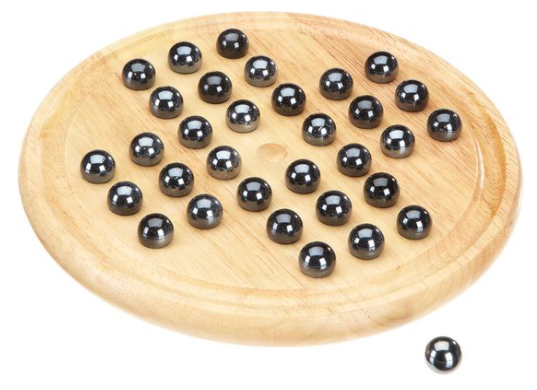
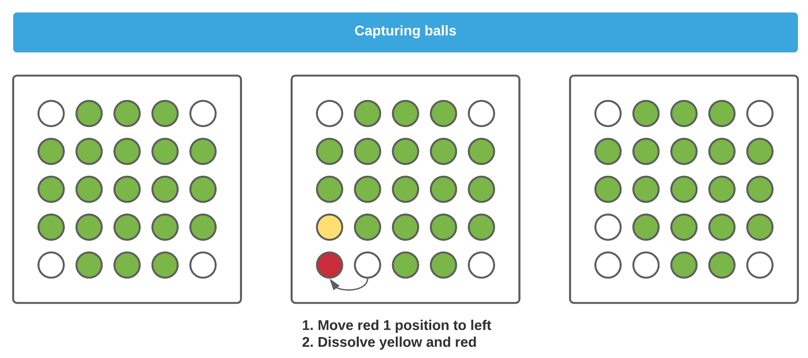
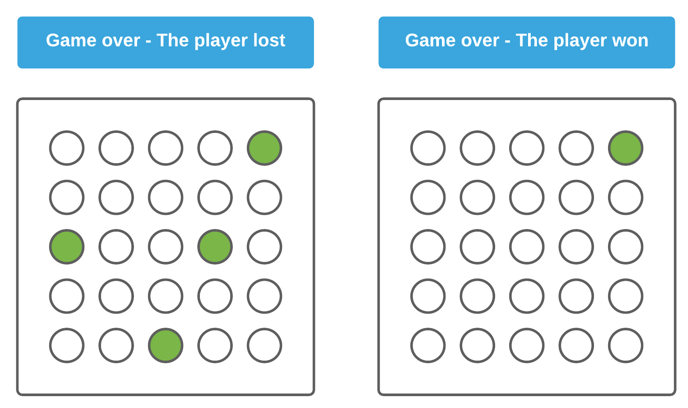
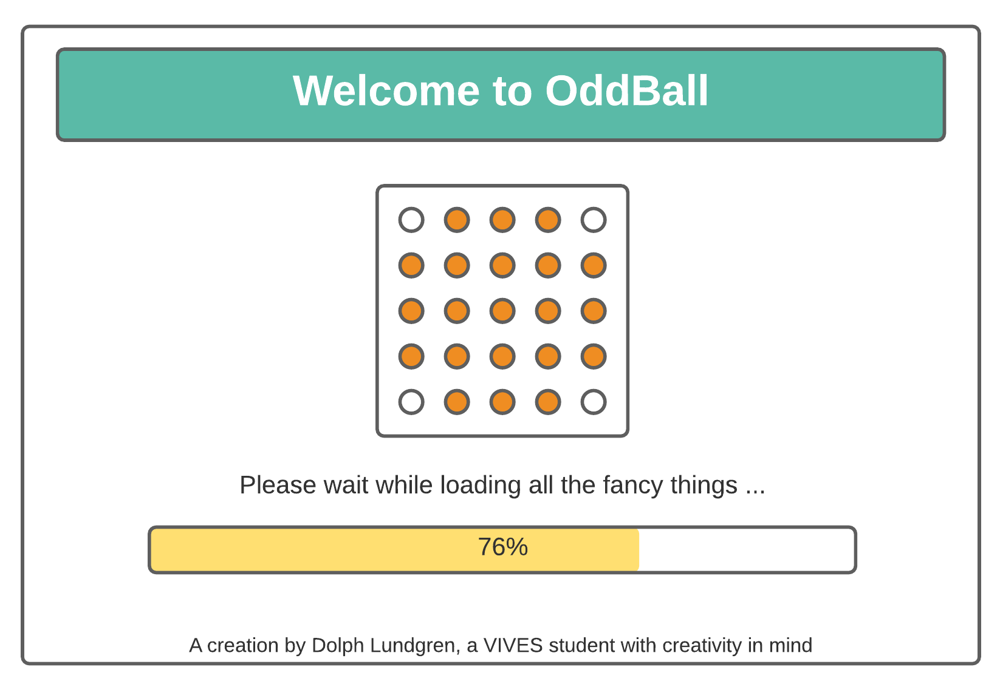
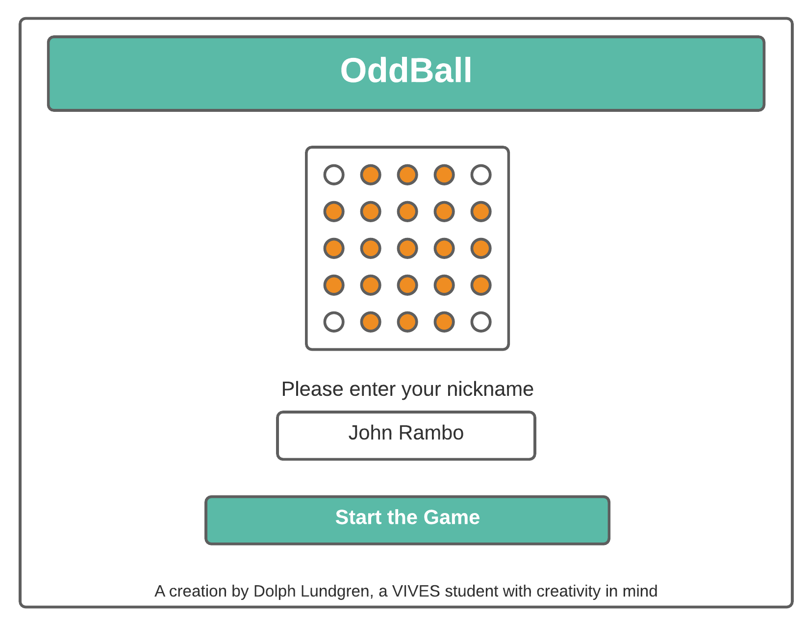
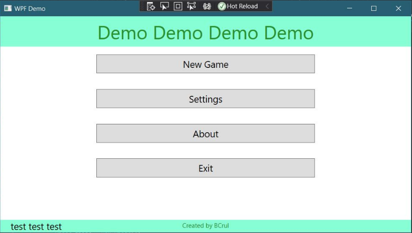
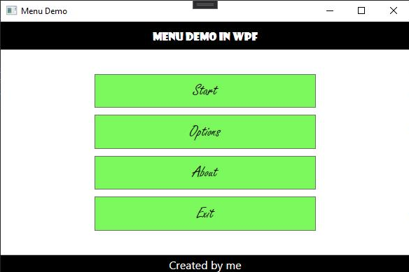

# CSharp Assignment - OddBall The Game

OddBall is a mangled clone of the chinese solitair game in which the player tries to capture all balls in the game except the last one.

A ball can be captured by moving a ball next to another one and removing both from the playfield. If multiple targets are available the player can choose which balls to dissolve.

The capturing ball (the one that is moved) can only move a single space - diagonally is not allowed.

The capturing ball needs to land next to it's target. If no target is available, its game over for the player.

## Assignment

### Step 1 - Game Logic

Create the game logic as a library that can be imported into a Csharp project.

### Step 2 - CSharp WPF Project

Create a CSharp WPF project inside the same solution.

### Step 3 - Create a Splash Screen

Create a splash screen for the game. This is basically a window that welcomes the player to OddBall, has a nice title and for example an image.

Feel free to experiment and add for example a fake loading bar.

It's pure about the UI, so you don't have to implement any functionality just yet.

### Step 4 - Login Screen

Create a login window that allows the user to input a nickname, which we'll later use to store the highscore.

Add a `TextBox` for the user to input his/her nickname and a `Button` to confirm the input.

Again, it's pure about the UI, so you don't have to implement any functionality just yet.

Feel free to be creative. Make it your own. Play with the styles and make your app attractive to use. Do however make sure to use the same style throughout your whole game. It should feel as a whole.

### Step 5 - About Window

Create a small about window that display some basic info about the game. How is it played, nice logo/image and some information about the developer (thats you btw).

### Step 6 - Menu Screen

Add a menu window to the application so the user can easily navigate between the different windows in the game.

Example:

Or:

The following items should be available as a minimum (feel free to add others):

* Start Game
* About
* Exit

### Where is the rest ?

The rest of the assignment will follow in the next weeks.
